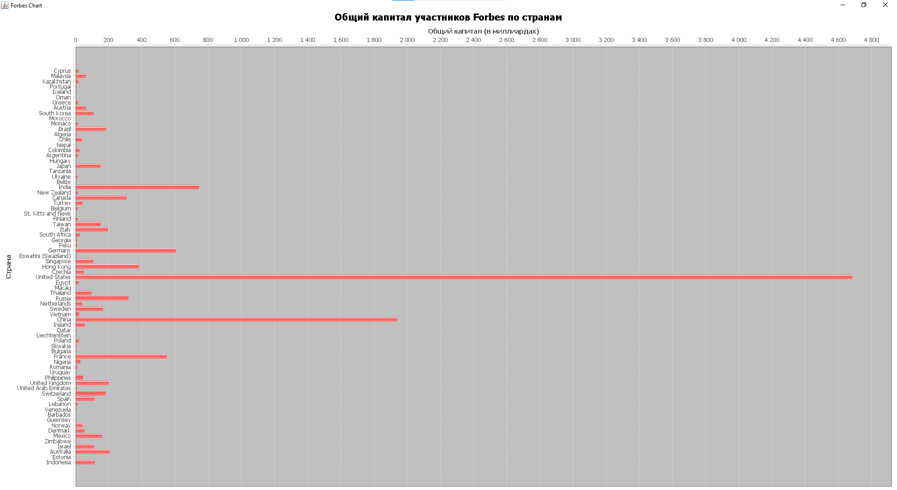

# Ulearn-Java-project, Forbes.csv, 9 вариант
1. Выбрал свой вариант задания согласно номеру в таблице.  
2. Разработал набор классов для хранения и обработки всех данных.  
CSVParser.java - для обработки CSV таблицы.  
DataBase.java - для взаимодействия с базой данных  
Person.java - для удобного хранения данных из таблицы  
ForbesChart.java - для вывода графиков  
Main.java - для запуска задач 
3. Распарсил CSV таблицу, создал набор объектов Person.
  
4. Создал файл с бд - db.db.
  
5. В бд создал набор таблиц соответствующих набору объектов.
  
6. Все данные из набора объектов Person сохранил в бд.
  
7. Сделал SQL - запросы: создание таблицы, удаление таблицы, вставка набора объектов Person в таблицу, получение самого молодого миллиардера из таблицы, получение имени и компании бизнесмена из США, имеющего самый большой капитал в сфере Energy.  
8. Полученные данные вывел в консоль(2,3 скриншоты).  
9. Числовые данные визуализировал в виде диаграмм(1 скриншот)  
10. Создал открытый репозиторий на github.  
11. Закомитил всю работу, описал шаги работы.  
12. Прикрепил ссылку на github репозиторий.  

## Скриншоты

Задача 1 - Построить график общего капитала участников Forbes, объединив их по странам.  

Задача 2 - Вывести самого молодого миллиардера из Франции, капитал которого превышает 10 млрд.  

Задача 3 - Вывести в консоль имя и компанию бизнесмена из США, имеющего самый большой капитал в сфере Energy.  

